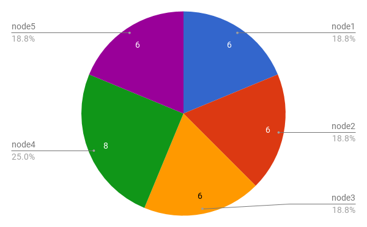
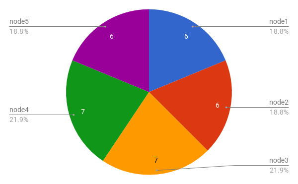

# Riak Core Claim Fixes

This post is about two bug fixes to
[riak-core's](https://github.com/basho/riak_core) claim code.

The post will cover the purpose of claim, the inputs, and the desired
properties of the output. Then a look at the bugs themselves, and how
we've fixed them.

First though, a quick look at the ring. Those of you who are confident
about the ring, what it is, and how it does it, skip down to
[Recent Work](#recent-work)

## Abstract and Concrete

As [Martin Sumner](https://twitter.com/masleeds) recently wrote in an
in depth look at
[claim in Riak](https://github.com/infinityworks/riak_core/blob/mas-claimv2issues/docs/ring_claim.md),
the ring is something often illustrated, a useful metaphor, and
typically a vaguely grasped abstraction. But the ring is not just
conceptual, it's a concrete thing in Riak: a datastructure that
describes a mapping of ownership as a routing table.

### The Key Space

Riak uses
[consistent hashing](https://en.wikipedia.org/wiki/Consistent_hashing)
to decide where to store replicas of data. An integer (2^160)
represents the entire key space. The key space is divided into a
number of ranges of equal size. The number of ranges is configured as
the _ring size_ for a cluster, and the ring size is always a power of
two. If the ring size is 64, then there will be 64 equal sized
_partitions_ of the key space (and so on for ring sizes of 8, 16, 32,
128, 512 etc.)

A hash function is used to turn any key into an integer in the key
space (i.e. `hash({"artist", "REM"}) ->
666603136322215606811169435479313437784925203632`). The result of the
hash function is an integer that falls inside one of the partitions,
or ranges, of the divided key space. The hash function is such that we
get an even distribution of values throughout the key space. So far,
so abstract.

### Ownership

Each of these ranges/divisions/partitions of the ring represents a
portion of the keys Riak stores. In order to spread the work evenly
throughout a Riak cluster each physical node _should_ own an equal
number of partitions.

Concretely the ring is a mapping of partitions of the key space to
physical nodes, denoting ownership. For each partition in the key
space there is an entry in the ring that points to a riak node
name. It says:

    "node1@host.domain owns partition
        1415829711164312202009819681693899175291684651008"

For each partition that it owns, a node will start a process. These
processes are called _vnodes_ for virtual node.

### A Routing Table

Since it maps out ownership, the ring is also a routing table. Any
node in a Riak cluster can run the hash function on a key and look up
in the ring which node owns the partition that key falls into and
route requests to that node. For this to work, every node needs a copy
of the ring, and ideally, all copies would agree as to which nodes own
which keys. Riak has a gossip protocol for spreading the ring
throughout a cluster and ensuring all nodes share a consistent view of
the ring. Hopefully a future post can describe gossip in detail.

### Replicas, Preference Lists, Primary and Fallback

Riak is a replicated database. By default it stores three replicas of
every key/value, the number of replicas is called the `n-val` meaning
there are `n` replicas, and by default `n=3`. As described above,
hashing the key gets a partition, and a partition is owned by a node,
and the node runs a vnode process for that partition. The vnode stores
the key/value, but what of the other replicas? In order to place the
`n-1` remaining replicas Riak uses the ring. Ordering the partitions
low-to-high Riak picks the nodes that own the next two partitions
following the one the key hashes to. This gives us a list of pairs
`[{partition(), node()}]` called the Preference List, or preflist for
short, which says exactly which processes on which physical nodes
should have copies of the data.

More specifically the preflist above is called a Primary
Preflist. Riak is a fault tolerant database, and if some node in the
Primary Preflist is not reachable to write or read a replica, Riak
uses the ring again. For any node in the primary preflist that is down
Riak will select the node for the next partition on the ring, and so
on, until it comes to a node that is up. Any node that stores a
replica but is not in the primary preflist is called a Fallback. A
Fallback will start a vnode process for the primary partition it
temporarily replaces and store a replica until such a time as the
primary is contactable.

Thinking about a key that hashes into one of the last two partitions
should clarify why the ring is called a ring. A key that hashes into
the last partition would have a preflist made up of that last
partition, followed by the first, and then the second partitions,
wrapping around the tail of the ring and back to the start.

We want at least `n` nodes in the ring if we want each replica to be
on it's own node. If we want to tolerate failures and still have each
replica on it's own node we need `n + f` nodes where `f` is the number
of node failures we need to tolerate. Basho's recommendation was that
you want at least 5 nodes in a Riak cluster.

Knowing how Riak constructs preflists from the ring, and how it
selects primaries and fallbacks is useful when we consider what
properties we might want from an algorithm that assigns partitions to
nodes. This algorithm is called Claim.

### Claim

Claim's job is to make the ring. As inputs it has the ring size (total
number of partitions), the list of nodes that make up the cluster, and
the current ring.

#### Spacing

Thinking about preflists, we want to distribute the partitions in such
a way that any preflist selected from the ring will lead to replicas
being stored on three distinct nodes. Ideally it should be able to
tolerate the failure of any node and still have every preflist contain
three distinct nodes. This spacing is called `target-n-val` and by
default it is set to four.

#### Balance

Since the vnode processes are the actors that do the work of reading
and writing data, it would be best if the same number of processes ran
on each node, meaning that all nodes would perform pretty equally. No
node would be much faster than the others, and crucially no node would
be much slower. Clearly if Ring Size is not divisible by Node Count we
can't get exactly the same number of vnodes per-node, but the
difference should be minimal.

## Recent Work

### Tail Violations

One issue with Claim as it stands today is that it does not address
"tail violations." For example, given a ring size of 16 with 5 nodes
added at once claim generates a ring where there are primary preflists
that do not have three distinct nodes. Claim assigns to each node in
order, partition one (`p1`) to node one (`n1`), `p2` to `n2`, `p3` to
`n3`, `p4` to `n4`, `p5` to `n5`, `p6` to `n1` and so on, finishing
with `p16` on `n1`. Both the preflists
`[{p15, n5}, {p16, n1}, {p1, n1}]` and
`[{p16, n1}, {p1, n1}, {p2, n2}]` violate the spacing requirements of
the ring. This can lead to dataloss if you expect there to be 3
distinct physical replicas of your data but in fact there may only be
2, and as such is an important bug to fix.

This bug was found by modifying the [quickcheck](http://www.quviq.com/products/) tests to add
multiple nodes to a cluster at once, and fixed by
[Ramen Sen](https://github.com/ramensen) of NHS Digital. The fix
firstly decides if there are tail violations (if the `ring size rem
node count` is greater than zero but less than `target-n-val`) and if
they can be solved given the number of nodes, target-n-val, and ring
size.

Think of the ring as a set of sequences, where a sequence is:

    [n1, n2, n3, n4, n5]

Then a ring for 16 vnodes with 5 nodes has 3 full sequences, and a
tail of n1

    [n1, n2, n3, n4, n5]
    [n1, n2, n3, n4, n5]
    [n1, n2, n3, n4, n5]
    [n1]

In the cases that tail violations can be solved they are done so by
increasing the tail of the ring so that there is no wrap around tail
violation and the tail ensures `target-n-val`:

    [n1, n2, n3, n4, n5]
    [n1, n2, n3, n4, n5]
    [n1, n2, n3, n4, n5]
    [n1, n2, n3, n4]

Each node added to the tail of the ring is then removed from previous
complete sequences. Lowest first from the previous sequence, and so on
back.

    [n1, n2, n3, n5]
    [n1, n2, n4, n5]
    [n1, n3, n4, n5]
    [n1, n2, n3, n4]

Leaving a ring where all preflists, even with a single node failure,
have three distinct nodes. The fix is slightly more complex, taking
larger chunks of sequences when possible, but the above should serve
as illustration.

### Balanced Rings

If we have 4 nodes and a ring of size 32 and a nicely balanced ring
where each node has 8 vnodes, and no tail violations but then add a
5th node, what happens? Claim takes the existing ring and adds the
`n5` to it. It calculates how many vnodes each node wants (6, since we
can't have a fraction of a vnode) and how many each existing node can
give up (2 each). It then decides on what the delta for each node
is. Nodes 1 through 4 have a delta of 2 which means they can give up
at most 2 vnodes. Node 5 has a delta of -6, meaning it wants 6
vnodes. Claim then takes vnodes from the existing nodes and assigns
them to the new node in such a way that `target-n-val`is not
violated. The bug is that claim takes all deltas from each node until
wants are satisfied. It takes 2 from node1, 2 from node2, 2 from node3
and then stops. Now node5 has all 6 wants met, and nodes 1 through 3
have 6 vnodes each, all good. Except that node4 has 8 vnodes, 33.3%
more than any other vnode. Node4 is going to be busy, and therefore
slow, and thusly trouble.

The fix for this issue is trivial. Rather than taking all the deltas
at once from a node, instead take a delta from each node in round
robin until the wants of the new node are met. This results in a ring
where two nodes have 7 vnodes and the rest have 6.

## Future Work

As well as fixing the two issues above and adding extra quickcheck
property tests to verify the fixes, there is work to be done. The
existing tests don't call the same code paths as the operator commands
`riak-admin cluster join | plan | remove | etc` which means there may
well be edges undetected and code untested. There is no test for
removing a node. To address this we've started work on a more thorough
quickcheck statem test that models the full life cycle of the ring
over many transitions of node adds and removes. However the ring,
claim, and gossip code seems to have grown organically and is spread
over a large surface in riak_core. This work will take some more time.

# Conclusion

These changes, though small, make claim safer and lead to better
behaved clusters. Though the tail violation issue could be detected if
a diligent operator followed
[best practices](https://www.tiot.jp/riak-docs/riak/kv/latest/setup/upgrading/checklist/#confirming-configuration-with-riaknostic)
and checked the output of the ring before moving to production, there
was no way to mitigate the issues.

These fixes will be released with the next version of Riak we create
for NHS-Digital, along with the new features from previous posts. If
you want to look at the code, or try it for yourself you can find it
[here](https://github.com/ramensen/riak_core/tree/rdb/rs-claim-tail-violations).
