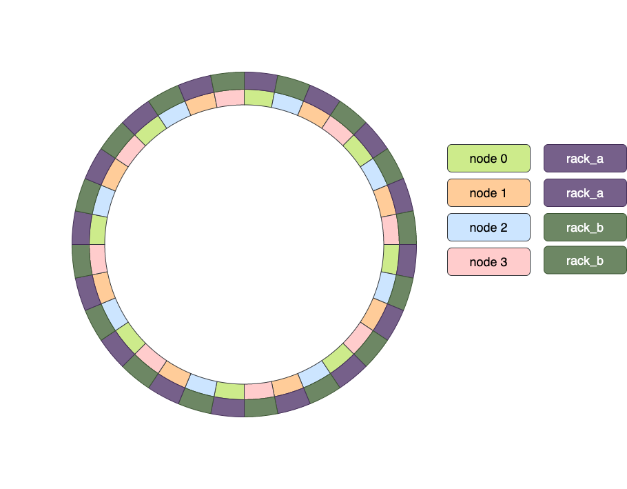

# Rack Awareness / Availability zones / Location support

The aim is to be able to increase data safety, and make the cluster more resilient 
against a location/site/availability zone/rack loss.

To achieve this, a location parameter has been introduced. 
It can be set at runtime for each RIAK node. 
When claiming a new ring, the list of nodes is ordered taking into consideration the 
location of the individual nodes, in a manner that adjacent nodes are preferably 
from different locations.

Basically it only changes the order of the nodes fed into the claiming algorithm.

The default location is `undefined`. This means every node with no location parameter set
will be handled as being in the same location. 
 
## Ring visualization



## Setup node's location parameter

Setting up nodes’ location parameter is a staged operation like 
other ring manipulations (join, leave, resize-ring, etc).

### via riak admin
Change current node location parameter:
```bash
riak admin cluster location rack_a
```
or specify a node:
```bash
riak admin cluster location site_b --node=dev2@127.0.0.1
```

#### by erlang function call

```erlang
riak_core_claimant:set_node_location(node(), "location_a"),
```
```erlang
riak_core_claimant:plan(),
riak_core_claimant:comit().
```
 
## Pitfalls
There are circumstances in which the preferable node location assignment cannot be guaranteed.

If at least one location parameter is set in the cluster when planning a cluster change, a warning
message will be displayed when not all nodes in a preflist are assigned to a different location. 

For example, if the default `n_val = 3` is specified and there are only `two distinct locations` set in the cluster, 
the message `WARNING: Not all replicas will be on distinct locations` will be shown.  

### Not enough distinct locations
When Distinct Location Count is not divisible by Ring size.

### Tail violations
When Ring Size not divisible by Count Of Nodes. 
[claim-fixes](claim-fixes.md) cover this, but improper distinct location count could result in undesirable location distribution within the ring.

For example, there are 8 nodes on 3 distinct locations. 
To ensure that every site/location has a piece of data, n_val must be at least 4.

It can be checked: 
```erlang 
{ok, Ring} = riak_core_ring_manager:get_my_ring(),
riak_core_location:check_ring(Ring, Nval = 4, MinimumNumberOfDistinctLocations = 3).
```

If `riak_core_location:check_ring/3` returns with an empty list `[]`, there is no location violation.
 
### Won't optimize transfers between old and new ring
When location parameter change triggers ring ownership change, it currently does not optimize transfers.
